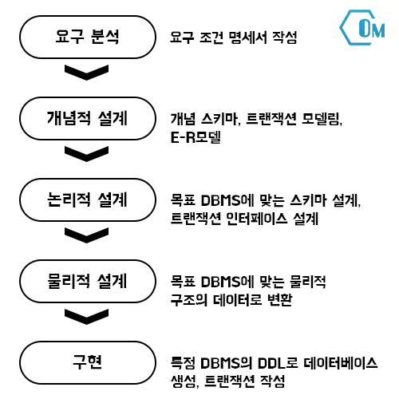

# 데이터베이스(Database)
데이터베이스는 특정 조직의 업무를 수행하는 데 필요한 상호 관련된 데이터들의 모임으로 다음과 같이 정의할 수 있다.

- 통합된 데이터 : 검색의 효율성을 위해 중복이 최소화된 데이터의 모임
- 저장된 데이터 : 컴퓨터가 접근할 수 있는 저장 매체에 저장된 데이터
- 운영 데이터 : 조직의 고유한 업무를 수행하는 데 존재 가치가 확실하고 없어서는 안 될 반드시 필요한 데이터
- 공용 데이터 : 여러 응용 시스템들이 공동으로 소유하고 유지하는 데이터

# 데이터베이스 설계
데이터베이스 설계는 사용자의 요구를 분석하여 그것들을 컴퓨터에 저장할 수 있는 데이터베이스의 구조에 맞게 변형한 후 특정 DBMS로 데이터베이스를 구현하여 일반 사용자들이 사용하게 하는 것이다.

__데이터베이스 설계 순서__
</img> 
# 스키마(Schema)
스키마는 데이터 베이스를 구성하는 개체, 속성, 관계 등 구조에 대한 정의와 이에 대한 제약 조건 등을 기술하는 것으로, 사용자의 관점에 따라 외부 스키마, 개념 스키마, 내부 스키마로 나뉜다.

- 외부 스키마 : 사용자나 응용 프로그래머가 각 개인의 입장에서 필요로 하는 데이터베이스의 논리적 구조를 정의한 것이다.

- 개념 스키마 : 데이터 베이스의 전체적인 논리적 구조로서, 모든 응용 프로그램이나 사용자들이 필요로 하는 데이터를 종합한 조직 전체의 데이터베이스로 하나만 존재한다.

- 내부 스키마 : 데이터베이스의 물리적 구조로, 데이터의 실제 저장 방법을 기술한다.

# 데이터베이스 사용자
__데이터베이스 관리자(DBA; DataBase Administrator)__ 
데이터베이스 관리자는 데이터베이스 시스템을 관리하고 운영에 관한 모든 것을 책임지는 사람이나 그룹으로 역할은 다음과 같다.

- 데이터베이스의 스키마를 정의, 생성, 삭제한다.
- 데이터 베이스 구성 요소를 결정한다.
- 데이터베이스의 저장 구조 및 접근 방법을 정의한다.
- 보안 및 데이터베이스의 접근 권한 부여 정책을 수립한다.
- 장애에 대비한 예비(Back Up) 조치와 회복(Recovery)에 대한 전략을 수립한다.
- 무결성을 위한 제약 조건을 지정한다.
- 데이터 사전을 구성하고 유지 관리한다.
- 사용자의 변화 요구와 성능 향상을 위해 데이터베이스를 재구성한다.

__응용 프로그래머__ 
응용 프로그래머는 일반 호스트 언어로 프로그램을 작성할 때 데이터 조작어를 삽입해서 일반 사용자가 응용 프로그램을 사용할 수 있게, 인터페이스를 제공할 목적으로 데이터베이스에 접근하는 사람들 이다.

__일반 사용자(End User)__ 
일반 사용자는 보통 터미널을 이용하여 데이터베이스에 있는 자원을 활용할 목적으로 질의어나 응용 프로그램을 사용하여 데이터베이스에 접근하는 사람들 이다.