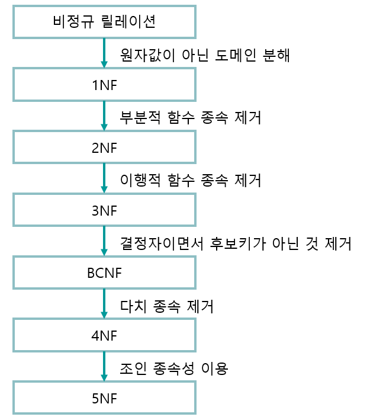

# 정규화의 개요
정규화란 함수적 종속성 등의 종속성 이론을 이용하여 잘못 설계된 관계형 스키마를 더 작은 속성의 세트로 쪼개어 바람직한 스키마로 만들어 가는 과정이다.

- 정규형에는 1NF(제1정규형), 2NF(제2정규형), 3NF(제3정규형), BCNF(Boyce-Codd 정규형), 4NF(제4정규형), 5NF(제5정규형)이 있다.
- 정규화는 데이터베이스의 개념적 설계 단계와 논리적 설계 단계 사이에서 수행한다.
- 개체들에 존재하는 데이터 속성의 중복을 최소화하여 일치성을 보장하며 데이터 모델을 단순하게 구성한다.
- 개체에 존재하는 함수적 종속 관계를 이용하여 데이터베이스 구조를 안정화 시킨다.
- 정규화는 논리적 처리 및 품질에 큰 영향을 미친다. 
</img> 
__암기 요령__ 
두부이걸다줘?  ≒ 도부이결다조

# 정규화의 목적
- 어떠한 릴레이션이라도 데이터벵스 내에서 표현 가능하게 만든다.
- 효과적인 검색 알고리즘을 생성할 수 있다.
- 중복을 배제하여 삽입, 삭제 갱신 이상의 발생을 방지한다.
- 데이터 삽입 시 릴레이션을 재구성할 필요성을 줄인다.
- 자료 저장공간의 최소화 및 데이터 구조의 안전성을 최대화 한다.
- 데이터베이스 내부 자료의 무결성 유지를 극대화 한다.

# 이상(Anomaly)의 개념 및 종류
정규화(Normalization)를 거치지 않으면 데이터베이스 내에 데이터들이 불필요하게 중복되어 릴레이션 조작 시 예기치 못한 곤란한 현상이 발셍하는데, 이를 '이상(Anomaly)'이라 하며 다음과 같이 삽입 이상, 삭제 이상, 갱신 이상이 있다.

- 삽입 이상(Insertion Anomaly) : 릴레이션에 데이터를 삽입할 떄 의도와는 상관없이 원하지 않은 값들도 함계 삽입되는 현상이다.
- 삭제 이상(Deletion Anomaly) : 릴레이션에서 한 튜플을 삭제할 때 의도와는 상관없는 값들도 함께 삭제되는 연쇄가 일어나는 현상이다.
- 갱신 이상(Update Anomaly) : 릴레이션에서 튜플에 있는 속성 값을 갱신할 때 일부 튜플의 정보만 갱신되어 정보에 모순이 생기는 현상이다.