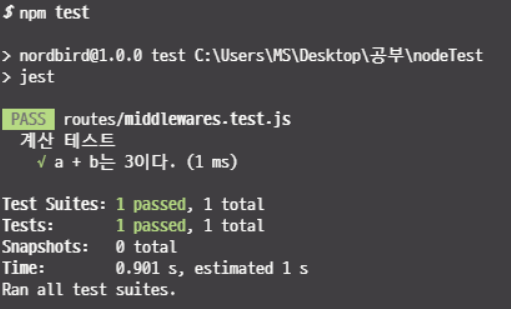

# Jest

> Jest는 페이스북에서 만들어서 React와 더불어 많은 자바스크립트 개발자들로 부터 좋은 반응을 얻고 있는 테스팅 라이브러리다.
> Jest는 라이브러리 하나만 설치하면, Test Runner와 Test Mathcher 그리고 Test Mock 프레임워크까지 제공해주기 때문에 현재 대세라고 말할 수 있다.

## Install

`npm i -D jest`

package.json에 스크립트를 추가한 후 npm test로 스크립트를 실행할 수 있다.

package.json

```json
scripts:{
    ...
    test:'jest'
}
```

## 기본 문법

test할 파일을 만든다. 파일명은 `테스트할함수명.test.js`식으로 짓는다.

middleware.test.js

```js
describe("계산 테스트", () => {
  const a = 1,
    b = 2;

  test("a + b는 3이다.", () => {
    expect(a + b).toEqual(3);
  });
});
```



> `describe`는 테스트 그룹을 묶어주는 역할을 한다.그 안의 콜백함수 내에 테스트에 쓰일 가자 변수,객체들을 선언하여 일회용으로 사용 할 수 있다.

> `toXxx` 부분에서 사용되는 함수를 Test Mathcer이라 한다. 위에서 사용된 toEqual() 함수는 값을 비교할때 사용한다.

> Jest는 기본적으로 test.js로 끝나거나, **test** 디렉터리 안에 있는 파일들은 모두 테스트 파일로 인식한다.
