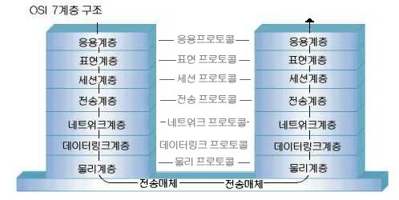

# OSI(Open System Interconnection) 참조 모델의 개요
OSI 참조 모델은 다른 시스템 간의 원활한 통신을 위해 ISO(국제표준화기구)에서 제안한 통식 규약(Protocol)이다.

- 개방형 시스템(Open System) 간의 데이터 통신 시 필요한 장비 및 처리 방법 등을 7단계로 표준화하여 규정했다.
- OSI 7계층은 1~3 계층을 하위 계층, 4~7 계층을 상위 계층이라고 한다.
    - 하위 계층 : 물리 계층 -> 데이터 링크 계층 -> 네트워크 계층
    - 상위계층 : 전송계층 -> 세션 계층 -> 표현 계층 -> 응용 계층<br>

</img><br/>

# OSI 참조 모델 계층별 특징
```
물리 계층(Physical Layer)
- 전송에 필요한 두 장치 간의 실제 접속과 절단 등 기계적, 전기적, 기능적 절차적 특성에 대한 규칙을 정의한다.
- RS-232C, X.21등의 표준이 있다.
- 프로토콜 데이터 단위는(PDU)는 비트(Bit)이다.

데이터 링크 계층(Data Link Layer)
- 두 개의 인접한 개방 시스템들 간에 신뢰성 있고 효율적인 정보 전송을 할 수 있도록 한다.
- HDLC, ADCCP, LLC, LAPB, LAPD 등의 표준이 있다.
- 프로토콜 데이터 단위는(PDU)는 프레임(Frame)이다.

네트워크 계층(Network Layer, 망 계층)
- 개방 시스템들 간의 네트워크 연결을 관리하는 기능과 데이터의 교환 및 중계 기능을 한다.
- X.25, ARP, IPX, IP 등의 표준이 있다.
- 프로토콜 데이터 단위(PDU)는 패킷(Packet)이다.

전송 계층(Transport Layer)
- 논리적 안정과 균일한 데이터 전송 서비스를 제공함으로써 종단 시스템(End-to-End) 간에 투명한 데이터 전송을 가능하게 한다.
- TCP, UDP 등의 표준이 있다.
- 프로토콜 데이터 단위(PDU)는 세그먼트(Segment)이다.

세션 계층(Session Layer)
- 송, 수신 측 간의 관련성을 유지하고 대화 제어를 담당한다.
- 프로토콜 데이터 단위(PDU)는 메시지(Message)이다.

표현 계층(Presentation Layer)
- 응용 계층으로부터 받은 데이터를 세션 계층에 보내기 전에 통신에 적당한 형태로 변환하고, 세션 계층에서 받은 데이터는 응용 계층에 맞게 변환하는 기능을 한다.
- 서로 다른 데이터 표현 형태를 갖는 시스템 간의 상호 접속을 위해 필요한 계층이다.
- 프로토콜 데이터 단위(PDU)는 메시지(Message)이다.

응용 계층(Application Layer)
- 사용자(응용 프로그램)가 OSI 환경에 접근할 수 있도록 서비스를 제공한다.
- 전자 사서함(SMTP), 파일 전송(FTP), 원격 접속(TELNET) 등의 서비스를 제공한다.
- 프로토콜 데이터 단위(PDU)는 메시지(Message)이다.
```
