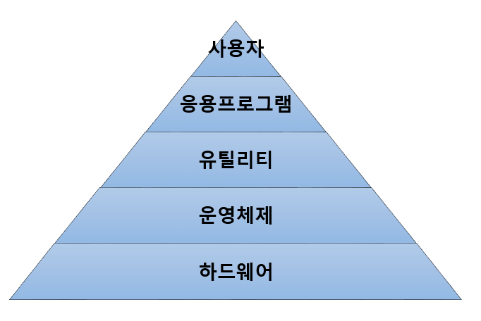

# 운영체제(Os; Operating System)의 정의
컴퓨터 시스템의 자원들을 효율적으로 관리하며, 사용자가 컴퓨터를 편리하고 효과적으로 사용할 수 있도록 환경을 제공하는 여러 프로그램의 모임이다.

- 컴퓨터 사용자와 컴퓨터 하드웨어 간의 인터페이스로서 동작하는 시스템 소프트웨어의 일종으로, 다른 응용 프로그램이 유용한 작업을 할 수 있도록 환경을 제공해 준다

</img><br/>

# 운영체제의 목적
운영체제의 목적에는 처리 능력 향상, 사용 가능도 향상, 신뢰도 향상, 반환 시간 단축 등이 있다.

- 처리 능력, 반환 시간, 사용 가능도 신뢰도는 운영체제의 성능을 평가하는 기준이 된다.

```
처리 능력 - 일정 시간 내에 시스템이 처리하는 일의 양

반환 시간 - 시스템에 작업을 의뢰한 시간부터 처리가 완료될 때까지 걸린 시간

사용 가능도 - 시스템을 사용할 필요가 있을 때 즉시 사용 가능한 정도

신뢰도 - 시스템이 주어진 문제를 정확하게 해결하는 정도
```

# 운영체제의 기능
- 프로세서, 기억장치(주기억 장치, 보조기억 장치), 입 º 출력장치, 파일 및 정보등의 자원을 관리한다.
- 자원을 효율적으로 관리하기 위해 자원의 스케줄링 기능을 제공한다.
- 사용좌와 시스템 간의 편리한 인터페이스를 제공한다.
- 시스템의 각종 하드웨어와 네트워크를 관리 º 제어한다.
- 데이터를 관리하고, 데이터 및 자원의 공유 기능을 제공한다.
- 시스템의 오류를 검사하고 복구한다.
- 자원 보호 기능을 제공한다.
- 입 º 출력에 대한 보조 기능을 제공한다.
- 가상 계산기 기능을 제공한다.

# 운영체제의 종류
운영체제의 종류에는 Windows, UNIX, LINUX, MacOS, MS-DOS, Android, iOS 등이 있다.
```
Windows - 마이크로소프트사가 개발한 운영체제
UNIX - AT&T 벨연구소, MIT, General Electric이 공동 개발한 운영체제
LINUX - 리누스 토발즈가 개발한 운영체제로 UNIX와 호환이 가능함
MacOS - 애플사가 UNIX를 기반으로 개발한 웅여체제
MS-DOS - Windows 이전에 사용되던 운영체제
Android - 구글사에서 개발한 리눅스 기반의 개방형 모바일 운영체제
iOS - 애플사에서 개발한 유닉스 기반의 모바일 운영체제
```

# 운영체제 운용 기법의 발달 과정
운영체제의 운영 기법은 다음과 같은 단계를 거쳐 발달하였다.
```
일괄 처리 시스템 -> 다중 프로그래밍 시스템 -> 시분할 시스템 -> 다중 처리 시스템 -> 실시간 처리 시스템 -> 범용 시스템 -> 분산 처리 시스템
```