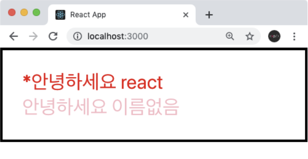

# Conditional Rendering

## Conditional Rendering(조건부 렌더링)의 정의
조건부 렌더링이란 특정 조건의 따라 다른 결과물을 렌더링 하는 것을 의미한다.
예를 들어 App 컴포넌트에서 Hello 컴포넌트를 사용할 때 `isSpecial`이라는 `props`를 설정하겠다.
```Javascript
function App() {
  return (
    <Wrapper>
      <Hello name="react" color="red" isSpecial={true}/>
      <Hello color="pink" />
    </Wrapper>
  )
}
```
여기서 `true`는 JS이기 때문에 {}로 감싸주었다.
그리고 Hello 컴포넌트에서는 `isSpecial`이 `true`이냐 `false`이냐에 따라 컴포넌트의 좌측에 `*` 표시를 해주겠습니다. 이를 처리하는 가장 기본적인 방법은 삼항연산자를 사용하는 것입니다.
```Javascript
function Hello({ color, name, isSpecial }) {
  return (
    <div style={{ color }}>
      { isSpecial ? <b>*</b> : null }
      안녕하세요 {name}
    </div>
  );
}

Hello.defaultProps = {
  name: '이름없음'
}
```
`isSpecial`값이 `true`라면 `<b></b>`를, 그렇지 않다면 `null`이 나타납니다. 참고로 JSX에서는 null, false, undefined를 렌더링하게된다면 아무것도 나타나지않습니다.



삼항연산자를 사용한 조건부 렌더링을 주로 특정 조건에 따라 보여줘야하는 내용이 다를 때 사용합니다.<br/>
지금은 내용이 달라지는게 아니라, 단순히 특정 조건이 `true` 이면 보여주고, 그렇지 않다면 숨겨주고 있는데요, 이러한 상황에서는 `&&` 연산자를 사용해서 처리하는 것이 더 간편합니다.
```Javascript
function Hello({ color, name, isSpecial }) {
  return (
    <div style={{ color }}>
      {isSpecial && <b>*</b>} <-
      안녕하세요 {name}
    </div>
  );
}

Hello.defaultProps = {
  name: '이름없음'
}
```
`isSpecial && <b>*</b>` 의 결과는 `isSpecial` 이 `  false` 일땐 `false` 이고, `isSpecial`이 `true` 일 땐 `<b>*</b>` 가 됩니다.

## props 값 설정을 생략하면 = {true}

컴포넌트의 props 값을 설정하게 될 때 만약 props 이름만 작성하고 값 설정을 생략한다면, 이를 `true` 로 설정한 것으로 간주합니다.
```Javascript
function App() {
  return (
    <Wrapper>
      <Hello name="react" color="red" isSpecial /> <-
      <Hello color="pink"/>
    </Wrapper>
  );
}
```
이처럼 `isSpecial`이름만 넣어주면 `isSpecial = {true}`와 동일한 의미입니다.