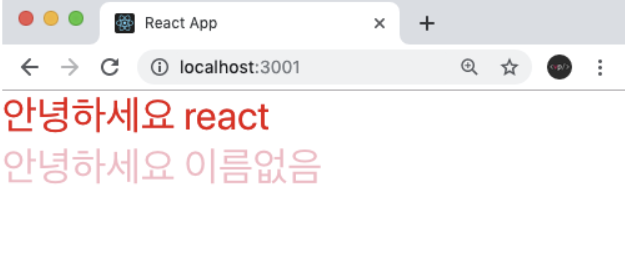
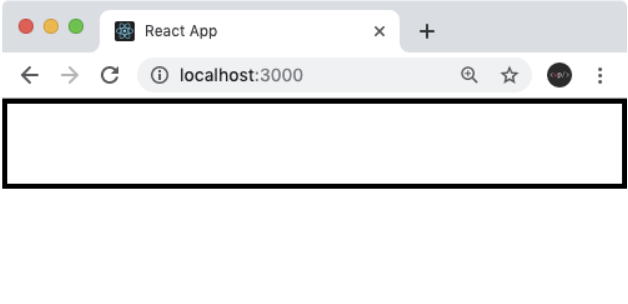
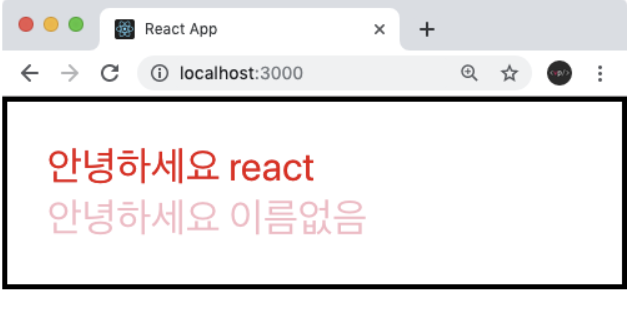

# props

## props의 정의
prop는 properties의 줄임말이다. 우리가 어떠한 값을 컴포넌트에 전달하여 줄 때 props를 사용한다.

## props의 기본 사용법
App컴포넌트에서 Hello 컴포넌트에 `name`란 값을 전달해 주고싶을때 예시를 들어보겠다.
```Javascript
function App() {
  return (
    <Hello name="react" /> <-
  );
}
```
`name`란 props를 전달 받았으면 Hello에서 props를 어떻게 사용하는지 알아보겠다.
```Javascript
function Hello(props) {
  return <div>안녕하세요 {props.name}</div> <-
}
```
컴포넌트에게 전달되는 props는 파라미터를 통해 확인 할 수 있다. props는 객체 형태로 전달되며, 만약 `name`값을 확인하고 싶다면 `props.name`으로 확인하면 된다. 

## 여러개의 props, 비구조화 할당
Hello 컴포넌트에 또 다른 props를 할당해보겠습니다.
`color`라는 값을 설정해봅시다.

```Javascript
function App() {
  return (
    <Hello name="react" color="red"/>
  );
}
```

이 다음 Hello 컴포넌트에서 `color`값을 조회해서 폰트의 색상으로 설정을 해보겠습니다.

```Javascript
function Hello(props) {
  return <div style={{ color: props.color }}>안녕하세요 {props.name}</div>
}
```
지금 props내부의 값들을 조회할 때마다 `props.`을 입력하고있습니다. 함수의 파라미터에서 비구조화 할당을 통(구조분해라고도 불림)문법을 사용하면 코드를 간결화 할 수 있다.

```Javascript
function Hello({ color, name }) {
  return <div style={{ color }}>안녕하세요 {name}</div>
}
```

## defaultProps로 기본값 설정
컴포넌트에 props를 지정하지 않았을 때 기본적으로 사용 할 값을 설정하고 싶다면 컴포넌트에 `defaultProps`라는 값을 설정하면 된다.

```Javascript
function Hello({ color, name }) {
  return <div style={{ color }}>안녕하세요 {name}</div>
}

Hello.defaultProps = {
  name: '이름없음'
}
```
이렇게 하고 App에서 name이 없는 Hello 컴포넌트를 실행한다면
```Javascript
function App() {
  return (
    <>
      <Hello name="react" color="red"/>
      <Hello color="pink"/>
    </>
  );
}
```
결과는 <br/>


이렇게 나올것이다.

## props.children
컴포넌트 태그 사이에 넣은 값을 조회하고 싶다면 `props.children`을 조회하면 된다.<br/>
`props.children`을 사용하는 컴포넌트를 만들어보겠다.
```Javascript
Wrapper.js
function Wrapper() {
  const style = {
    border: '2px solid black',
    padding: '16px',
  };
  return (
    <div style={style}>

    </div>
  )
}
```
```Javascript
App.js
function App() {
  return (
    <Wrapper>
      <Hello name="react" color="red"/>
      <Hello color="pink"/>
    </Wrapper>
  );
}
```
이렇게 Wrapper 태그 내부에 Hello 컴포넌트 2개를 넣었습니다. 브라우저를 확인하면 Hello컴포넌트가 보이지 않슴니다.


안의 내용이 보여지게 하기 위해서는 Wrapper에서 `props.children`을 렌더링해주어야합니다.
```Javascript
function Wrapper({ children }) {
  const style = {
    border: '2px solid black',
    padding: '16px',
  };
  return (
    <div style={style}>
      {children}
    </div>
  )
}
```
