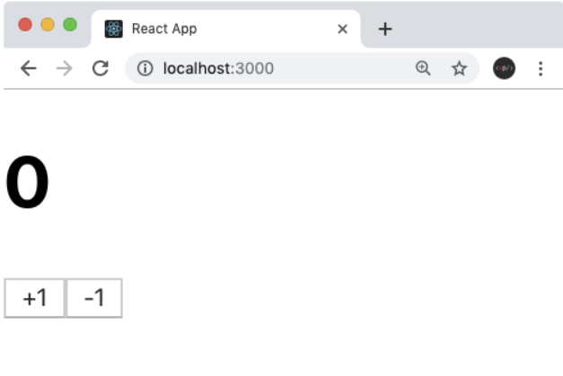
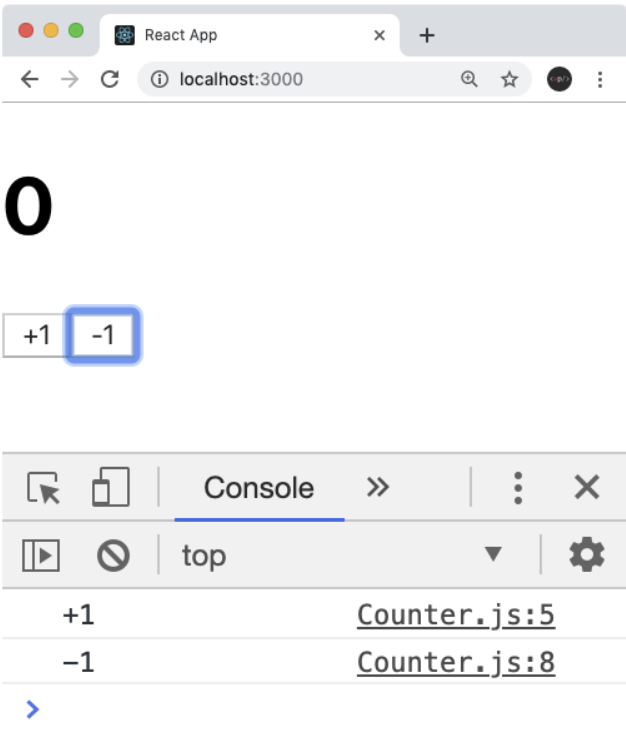
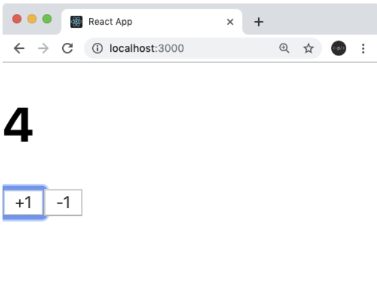

# useState로 컴포넌트에서 바뀌는 값 관리하기

## useState의 정의

동적인 컴포넌트를 만들기 위해서는 리액트 16.8버전부터 도입된 Hooks를 사용하여 함수형 컴포넌트에서도 상태를 관리할 수 있게되었습니다. useState함수도 Hooks중 하나입니다.

## 예제
```Javascript
Counter.js
function Counter() {
  return (
    <div>
      <h1>0</h1>
      <button>+1</button>
      <button>-1</button>
    </div>
  );
}
```
Counter.js를 App에서 렌더링 합니다.
```Javascript
App.js
function App() {
  return (
    <Counter />
  );
}
```


이런 UI가 보일것입니다.

## 이벤트 설정
Counter 버튼을 눌렀을때 특정 함수가 호출이 되도록 코드를 변경하겠습니다.
```Javascript
function Counter() {
  const onIncrease = () => {
    console.log('+1')
  }
  const onDecrease = () => {
    console.log('-1');
  }
  return (
    <div>
      <h1>0</h1>
      <button onClick={onIncrease}>+1</button>
      <button onClick={onDecrease}>-1</button>
    </div>
  );
}
```
리액트에서 엘리먼트에 이벤트를 설정해줄때에는 `on이벤트이름={실행하고싶은함수}` 형태로 설정해주어야 합니다.<br/>
주의해야될 점은 함수형태를 넣어야합니다
```Javascript
onClick={onIncrease()}
onClick={onDecrease()}
```
이렇게 하면 렌더링 되는 시점에 함수가 호출이되어버립니다. 고로 이벤트를 설정할때는 함수 타입의 값을 넣어야 합니다.

이제 저장하고 출력하면 콘솔창에 잘 뜰것입니다.


## 동적인 값 끼얹기, useState
컴포넌트에서 동적인 값을 상태(state)라고 부릅니다. 리액트에 `useState` 라는 함수가 있는데요, 이것을 사용하면 컴포넌트에서 상태를 관리 할 수 있습니다.

Counter컴포넌트를 다음과 같이 수정해주세요 
```Javascript
function Counter() {
  const [number, setNumber] = useState(0);

  const onIncrease = () => {
    setNumber(number + 1);
  }

  const onDecrease = () => {
    setNumber(number - 1);
  }

  return (
    <div>
      <h1>{number}</h1>
      <button onClick={onIncrease}>+1</button>
      <button onClick={onDecrease}>-1</button>
    </div>
  );
}
```
이렇게 해주신다면
```Javascript
import React,{useState} from 'react';
```
코드가 추가될 것입니다. 이 코드는 리엑트 패키지에서 useState를 불러옵니다.
```Javascript
const [number, setNumber] = useState(0);
```
`useState`를 사용 할 때에는 상태의 기본값을 파라미터로 넣어서 호출합니다. 이 함수를 호출해주면 배열이 반환되는데요, 여기서 첫번째 원소는 현재 상태, 두번째 원소는 Setter 함수입니다.

Setter함수는 파라미터로 전달받은 값을 최신상태로 설정해줍니다.
```Javascript
<h1>{number}</h1>
```
이제 h1태그에서는 0이아닌 `{number}`를 보여줄 것입니다. 실행해보면 `{number}`이 잘 바뀌는 것을 볼 수있습니다.


## 함수형 업데이트
지금은 Setter 함수를 사용 할 때, 업데이트 하고 싶은 새로운 값을 파라미터로 넣어주고 있는데요, 그 대신에 기존 값을 어떻게 업데이트 할 지에 대한 함수를 등록하는 방식으로도 값을 업데이트 할 수 있습니다.
```Javascript
function Counter() {
  const [number, setNumber] = useState(0);

  const onIncrease = () => {
    setNumber(prevNumber => prevNumber + 1);
  }

  const onDecrease = () => {
    setNumber(prevNumber => prevNumber - 1);
  }

  return (
    <div>
      <h1>{number}</h1>
      <button onClick={onIncrease}>+1</button>
      <button onClick={onDecrease}>-1</button>
    </div>
  );
}
```
`onIncrease` 와 `onDecrease` 에서 `setNumber` 를 사용 할 때 그 다음 상태를 파라미터로 넣어준것이 아니라, 값을 업데이트 하는 함수를 파라미터로 넣어주었습니다.

함수형 업데이트는 주로 나중에 컴포넌트를 최적화를 하게 될 때 사용하게 됩니다.
