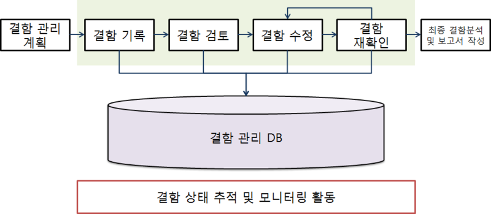

# 결함(Fault)의 정의
결함은 오류 발생, 작동 실패 등과 같이 소프트웨어가 개발자가 설계한 것과 다르게 동작하거나 다른 결과가 발생되는 것을 의미한다.

- 일반적인 결함의 판단 기준은 다음과 같다.
    - 기능 명세서에 가능하다고 명시된 기능이 수행되지 않는 경우
    - 기능 명세서에 명시되어 있지는 않지만 수행해야만 하는 기능이 수행되지 않는 경우
    - 테스트 시각에서 보았을 때 문제가 있다고 판단되는 경우

# 결함 관리 프로세스
결함 관리 프로세스는 애플리케이션 테스트에서 발견된 결함을 처리하는 것으로, 처리 순서는 다음과 같다.

1. 결함 관리 계획 : 전체 프로세스에 대한 결함 관리 일정, 인력, 업무 프로세서 등을 확보하여 계획을 수립하는 단계이다.
2. 결함 기록 : 테스터는 발견된 결함을 견함 관리 DB에 등록한다.
3. 결함 검토 : 테스터, 프로그램 리더, 품질 관리(QA) 담당자 등은 등록된 결함을 검토하고 결함을 수정할 개발자에게 전달한다.
4. 결함 수정 : 개발자는 전달받은 결함을 수정한다.
5. 결함 재확인 : 테스터는 개발자가 수정한 내용을 확인하고 다시 테스트를 수행한다.
6. 결함 상태 추적 및 모니터링 활동 : 결함 관리 DB를 이용하여 프로젝트별 결함 유형, 발생률 등을 한눈에 볼 수 있는 대시보드 또는 게시판 형태의 서비스를 제공한다.
7. 최정 결함 분석 및 보고서 작성 : 발견된 결함에 대한 정보와 이해관계자들의 의견이 반영된 보고서를 작성하고 결함 관리를 종료한다.<br>
</img><br/>

# 결함 상태 추적
테스트에서 발견된 결함은 지속적으로 상태 변화를 추적하고 관리해야 한다.

- 발견된 결함에 대해 결함 관리 측정 지표의 속성 값들을 분석하여 향후 결함이 발견될 모듈 또는 컴포넌트를 추정할 수 있다.
- __결함 관리 측정 지표__
```
결함 분포 - 모듈 또는 컴포넌트의 특정 속성에 해당하는 결함 수 측정
결함 추세 - 테스트 진행 시간에 따른 결함 수의 추이 분석
결함 에이징 - 특정 결함 상태로 지속되는 시간 측정
```
- __결함 상태__
```
Open - 결함이 보고만 되고 분석되지 않은 상태
Assigned - 결함의 영향 분석 및 수정을 위해 개발자에게 결함이 전달된 상태
Fixed - 개발자에 의해 결함 수정이 완료된 상태
Closed - 수정된 결함에 대해 테스트를 다시 했을 때 결함이 발견되지 않은 상태
Deffered - 결함 수정이 연기된 상태
Classified - 보고된 결함을 관련자들이 확인했을 때 결함이 아니라고 확인된 상태
```

# 결함 추적 순서
결함 추적은 결함이 발견된 때부터 결함이 해결될 떄까지 전 과정을 추적하는 것으로 순서는 다음과 같다.

1. 결함 등록(Open) : 테스터와 품질 관리(QA) 담당자에 의해 발견된 결함이 등록된 상태
2. 결함 검토(Reviewed) : 등록된 결함을 테스터, 품질 관리(QA) 담당자, 프로그램 리더, 담당 모듈 개발장 의해 검토된 상태
3. 결함 할당(Assigned) : 결함을 수정하기 위해 개발자와 문제 해결 담당자에게 결함이 할당된 상태
4. 결함 수정(Resolved) : 개발자가 결함 수정을 완료한 상태
5. 결함 조치 보류(Deferred) : 결함의 수정이 불가능해 연기된 상태로, 우선순위, 일정 등에 따라 재오픈을 준비중인 상태
6. 결함 종료(Closed) : 결함이 해결되어 테스터와 품질 관리(QA) 담당자가 종료를 승인한 상태
7. 결함 해재(Clarified) : 테스터, 프로그램 리더, 품질 관리(QA) 담당자가 종료 승인한 결함을 검토하여 결함이 아니라고 판명한 상태

# 결함 분류
테스트에서 발견되는 결함을 유형별로 분류하면 다음과 같다.
```
시스템 결함
- 시스템 다운, 애플리케이션의 작동 정지, 종료, 응답 시간 지연, 데이터베이스 에러 등 주로 애플리케이션 환경이나 데이터베이스 처리에서 발생된 결함

기능 결함
- 사용자의 요구사항 미반영/불일치, 부정확한 비즈니스 프로세스, 스크립트 오류, 타 시스템 연동 시 오류 등 애플리케이션의 기획, 설계, 업무 시나리오 등의 단계에서 유입된 결함

GUI 결함
- UI 비일관성, 데이터 타입의 표시 오류, 부정확한 커서/메시지 오류 등 사용자 화면 설계에서 발생된 결함

문서 결함
- 사용자의 요구사항과 기능 요구사항의 불일치로 인한 불완전한 상태의 문서, 사용자의 온라인/오프라인 매뉴얼의 불일치 등 기획자, 사용자, 개발자 간의 의사소통 및 기록이 원활하지 않아 발생된 결함
```
 
# 결함 관리 도구
결함 관리 도구는 소프트웨어에 발생한 결함을 체계적으로 관리할 수 있도록 도와주는 도구로, 다음과 같은 것들이 있다.
```
Mantis
- 결함 및 이슈 관리 도구로, 소프트웨어 설계 시 단위별 작업 내용을 기록할 수 있어 결함 추적도 가능한 도구

Trac
- 결함 추적은 물론 결함을 통합하여 관리할 수 있는 도구

Redmine
- 포르젝트 관리 및 결함 추적이 가능한 도구

Bugzilla
- 결함 신고, 확인, 처리 등 결함을 지속적으로 관리할 수 있는 도구로, 결함의 심각도 와 우선순위를 지정할 수도 있다.
```