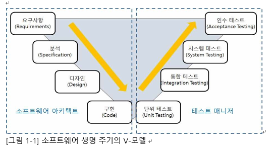

# 개발 단계에 따른 애플리케이션 테스트
애플리케이션 테스트는 소프트웨어의 개발 단계에 따라 단위 테스트, 통합 테스트, 시스템 테스트, 인수 테스트로 분류된다. 이렇게 분류된 것을 테스트 레벨이라고 한다.

- 애플리케이션 테스트는 소프트웨어의 개발 단계에서부터 테스트를 수행하므로 단순히 소프트웨어에 포함된 코드 상의 오류뿐만 아니라 요구 분석의 오류, 설계 인터페이스 오류 등도 발견할 수 있다.
- 애플리케이션 테스트와 소프트웨어 개발 단계를 연결하여 표현한 것을 V-모델이라 한다.<br>
</img><br/>

# 단위 테스트(Unit Test)
단위 테스트는 코딩 직후 소프트웨어 설계의 최소 단위인 모듈이나 컴포넌트에 초점을 맞춰 테스트 하는 것이다.

- 단위 테스트에서는 인터페이스, 외부적 I/O, 자료 구조, 독립적 기초 경로, 오류 처리 경로, 경계 조건 등을 검사한다.
- 단위 테스트는 사용자의 요구사항을 기반으로 한 기능성 테스트를 최우선으로 수행한다.
- 단웨 테스트는 구조 기반 테스트와 명세 기반 테스트로 나뉘지만 주로 구조 기반 테스트를 시행한다.
```
구조 기반 테스트 : 프로그램 내부 구조 및 복잡도를 검증하는 화이트박스 테스트 시행 / 목적 : 제어 흐름, 조건 결정

명세 기반 테스트 : 목적 및 실행 코드 기반의 블랙박스 테스트 시행 / 목적 : 동등 분할, 경계 값 분석 
```

# 통합 테스트(Integration Test)
통합 테스트는 단위 테스트가 완료된 모듈들을 결합하여 하나의 시스템으로 완성시키는 과정에서의 테스트를 의미한다.

- 통합 테스트는 모듈 간 또는 통합된 컴포넌트 간의 상호 작용 오류를 검사한다.

# 시스템 테스트(System Test)
시스템 테스트는 개발된 소프트웨어가 해당 컴퓨터 시스템에서 완벽하게 수행 되는가를 점검하는 테스트이다.

- 황경적인 장애 리스크를 최소화하기 위해서는 실제 사용 환경과 유사하게 만든 테스트 환경에서 테스트를 수행해야 한다.
- 시스템 테스트는 기능적 요구사항과 비기능적 요구사항으로 구분하여 각각을 만족하는지 테스트한다.

```
기능적 요구사항
- 요구사항 명세서, 비즈니스 절차, 유스케이스 등 명세서 기반의 블랙박스 테스트 시행

비기능적 요구사항
- 성능 테스트, 회복 테스트, 보안 테스트, 내부 시스템의 메뉴 구조, 웹페이지의 네비게이션 등 구조적 요소에 대한 화이트박스 테스트 시행
```

# 인수 테스트(Acceptance Test)
인수 테스트는 개발한 소프트웨어가 사용자의 요구사항을 충적하는지에 중점을 두고 테스트하는 방법이다.
- 인수 테스트는 개발한 소프트웨어를 사용자가 직접 테스트한다.
- 인수 테스트에 문제가 없으면 사용자는 소프트웨어를 인수하게 되고, 프로젝트는 종료된다.
- 인수테스트는 다음과 같이 6종류로 구분해서 테스트한다.
```
사용자 인수 테스트
- 사용자가 시스템 사용의 적절성 여부를 확인한다.

운영상 인수 테스트
- 시스템 관리자가 시스템 인수 시 수행하는 테스트 기법으로, 백업/복원 시스템, 재난 복구, 사용자 관리, 정기 점검 등을 확인한다.

계약 인수 테스트
- 계약상의 인수/검수 조건을 준수하는지 여부를 확인한다.

규정 인수 테스트
- 소프트웨어가 정부 지침, 법규, 규정 등 규정에 맞게 개발되었는지 확인한다.

알파 테스트
- 개발자의 장소에서 사용자가 개발자 앞에서 행하는 테스트 기법이다.
- 테스트는 통제된 환경에서 행해지며, 오류와 사용상의 문제점을 사용자와 개발자가 함께 확인하면서 기록한다.

베타 테스트
- 선정된 최종 사용자가 여러 명의 사용자 앞에서 행하는 테스트 기법이다.
- 실업무를 가지고 사용자가 직접 테스트하는 것으로 개발자에 의해 제어되지 않은 상태ㅔ서 테스트가 행해지며, 발견된 오류와 사용상의 문제점을 기록하고 개발자에게 주기적으로 보고한다.
```